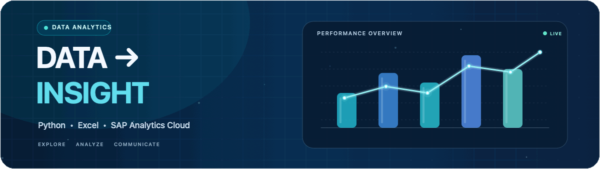

# Kriyank Patil

**Early-Career Data Analyst | Python | Excel | SAP Analytics Cloud**

I have an Information Technology background and training in data analysis, visualization, and dashboarding. My learning includes Python and pandas, Excel, IBM Cognos Analytics, SAP Analytics Cloud, and SAP HANA fundamentals.

I completed a 350+ hour Data Analytics program with a Data Engineering specialization through SAP India’s Educate to Employ initiative, implemented by Edunet Foundation. I’ve also completed internships in Data Analytics with CSRBOX and Python (Django) with Grownited.

## Selected projects

- [Vehicle Vault](https://github.com/kriyankpatil/Vehicle_Vault) — Django vehicle discovery and comparison application.
- [Gesture Detection](https://github.com/kriyankpatil/Gesture-Detection-) — Python project for hand-gesture controls.
- [AI Resume Builder](https://github.com/kriyankpatil/AI-Resume-Builder) — resume-building web application.

## Verified credentials

- [Data Analysis & Visualization Foundations Specialization (V2)](https://www.credly.com/badges/ac13c476-8d82-46d4-86ef-8c3fca05b38a)
- [Data Analytics Essentials](https://www.credly.com/badges/de8dac53-c591-4317-bed5-013e55c3739f)
- [Data Visualization & Dashboard Essentials](https://www.credly.com/badges/71a4400f-f9ad-4299-9cdb-8933b501db8c)
- [Excel Essentials for Data Analytics](https://www.credly.com/badges/5e6b8480-f0bc-4ef8-9b90-497d2f2a3385)
- [Exploring SAP Analytics Cloud](https://www.credly.com/badges/d769f832-3118-44f3-bb02-fa67f48f9c86)
- [Getting Started with Data — IBM SkillsBuild](https://www.credly.com/badges/30553ee7-55d9-4877-a8dd-ac3783423f20)

LinkedIn: https://www.linkedin.com/in/kriyank/
